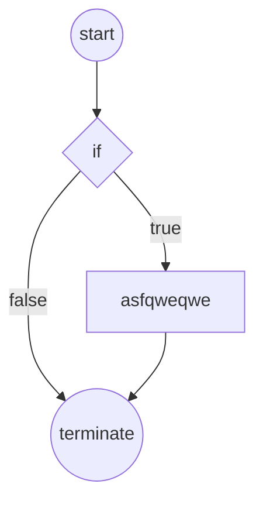
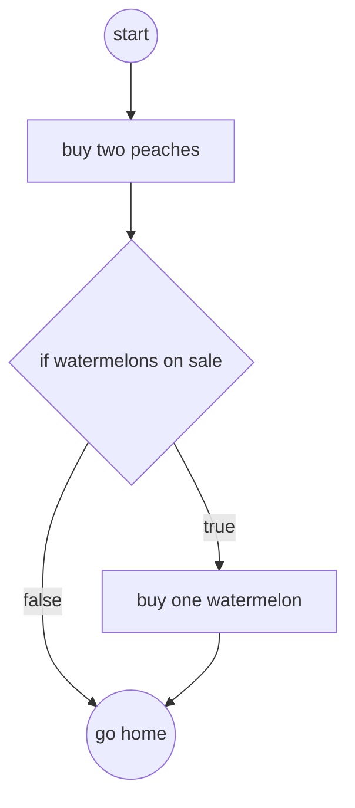
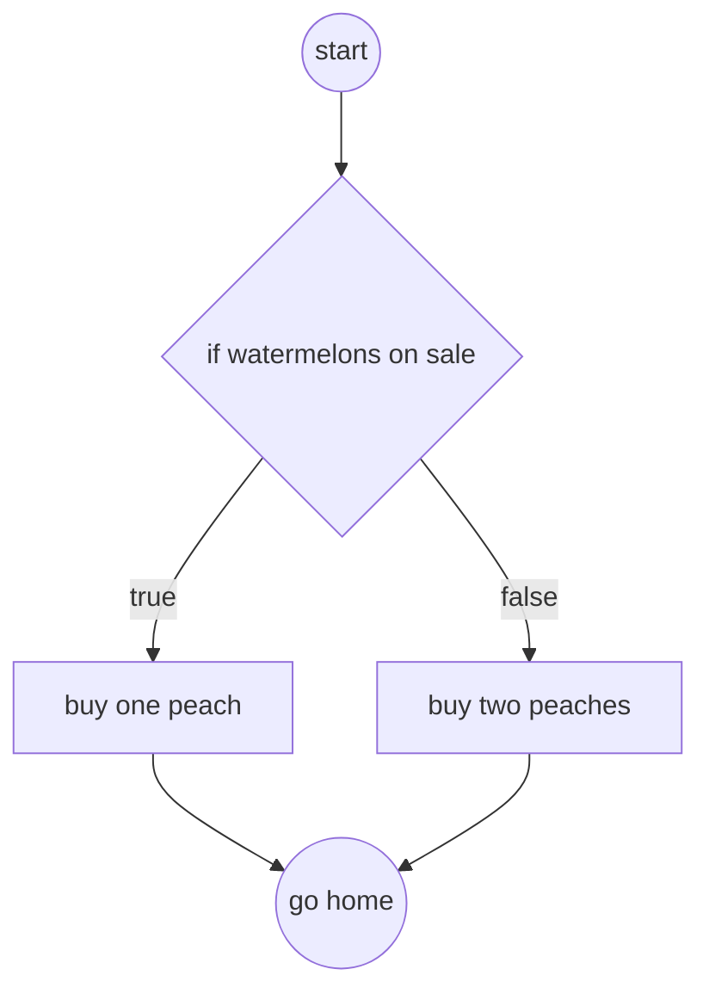

## draw flowchart in markdown

```mermaid
graph TD
strat((start)) --> if{if}
if -- true --> A[asfqweqwe]
if -- false --> terminate((terminate))
A --> terminate
```

Bro Deng's thought

```mermaid
graph TD
start((start)) --> buyPeaches[buy two peaches]
buyPeaches --> if{if watermelons on sale}
if -- true --> buyWatermelon[buy one watermelon]
if -- false --> terminate((go home))
buyWatermelon --> terminate
```

Bro Cheng's thought

```mermaid
graph TD
start((start)) --> if{if watermelons on sale}
if -- true --> buyPeach[buy one peach]
if -- false --> buyPeaches[buy two peaches]
buyPeach --> terminate((go home))
buyPeaches --> terminate
```