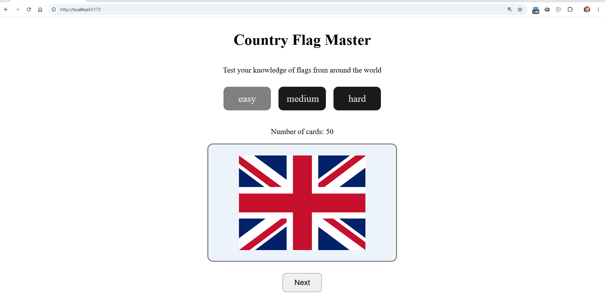

# Web Development Project 2 - Country Flag Master

Submitted by: **Jiaxing Rong**

This web app helps users practice identifying country flags. Users can choose
an easy, medium, or hard difficulty, flip each card to reveal the country name,
and move to another randomly selected flag.

Time spent: **5** hours spent in total

## Required Features

The following **required** functionality is completed:

- [x] **The app displays the title of the card set, a short description, and the total number of cards**
  - [x] Title of card set is displayed
  - [x] A short description of the card set is displayed
  - [x] A list of card pairs is created
  - [x] The total number of cards in the selected difficulty is displayed
  - [x] Card set is represented as arrays of country objects containing names and country codes
- [x] **A single card at a time is displayed**
  - [x] Only one half of the information pair is displayed at a time
- [x] **Clicking on the card flips the card over, showing the corresponding component of the information pair**
  - [x] Clicking on a card flips it over and shows the country name
  - [x] Clicking on a flipped card again flips it back and shows the flag
- [x] **Clicking on the next button displays a random new card**

The following **optional** features are implemented:

- [x] Cards contain images in addition to or in place of text
  - [x] The front of each card displays a country flag image
- [x] Cards have different visual styles such as color based on their category
  - [x] Cards use random RGBA background colors with opacity based on easy, medium, or hard difficulty

The following **additional** features are implemented:

- [x] Users can choose between easy, medium, and hard country sets
- [x] The app avoids displaying the same country twice in a row
- [x] Cards include a 3D flip animation
- [x] Card background opacity increases on hover
- [x] Cards resize on smaller screens

## Video Walkthrough

Here's a walkthrough of implemented required features:

<!-- Replace the link above with the URL for your walkthrough GIF. -->
GIF created with **ScreenToGif**

## Notes

One challenge was creating a smooth card-flip animation while keeping the flag
on the front and the country name on the back. I used AI to help understand how
CSS properties such as `perspective`, `transform-style`, `rotateY`, and
`backface-visibility` work together to create the animation.

Another challenge was loading many flag images dynamically. The app uses
Vite's `import.meta.glob` to map each country code and difficulty to the
matching SVG file.

## License

    Copyright 2026 Jiaxing Rong

    Licensed under the Apache License, Version 2.0 (the "License");
    you may not use this file except in compliance with the License.
    You may obtain a copy of the License at

        http://www.apache.org/licenses/LICENSE-2.0

    Unless required by applicable law or agreed to in writing, software
    distributed under the License is distributed on an "AS IS" BASIS,
    WITHOUT WARRANTIES OR CONDITIONS OF ANY KIND, either express or implied.
    See the License for the specific language governing permissions and
    limitations under the License.
