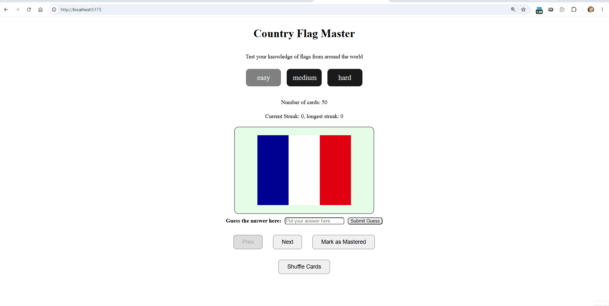

# Web Development Project 3 - Country Flag Master

Submitted by: **Jiaxing Rong**

This web app: **Country Flag Master helps users practice identifying country flags by flipping flashcards, submitting guesses, tracking correct-answer streaks, shuffling the deck, and removing mastered cards from the active pool.**

Time spent: **6** hours spent in total

## Required Features

The following **required** functionality is completed:

- [x] **The user can enter their guess into an input box *before* seeing the flipside of the card**
  - [x] Application features a clearly labeled input box with a submit button where users can type in a guess
  - [x] Clicking on the submit button with an **incorrect** answer shows visual feedback that it is wrong
  - [x] Clicking on the submit button with a **correct** answer shows visual feedback that it is correct
- [x] **The user can navigate through an ordered list of cards**
  - [x] A forward/next button displayed on the card navigates to the next card in a set sequence when clicked
  - [x] A previous/back button displayed on the card returns to the previous card in the set sequence when clicked
  - [x] Both the next and back buttons have visual indication that the user is at the beginning or end of the list by becoming disabled and grayed out, preventing wrap-around navigation

The following **optional** features are implemented:

- [x] Users can use a shuffle button to randomize the order of the cards
  - [x] Cards remain in the same sequence while navigating unless the shuffle button is clicked
  - [x] Cards change to a random sequence once the shuffle button is clicked
- [x] A user's answer may be counted as correct even when it is slightly different from the target answer
  - [x] Answers are checked without uppercase/lowercase discrepancies
  - [x] Leading and trailing whitespace is ignored before checking the answer
- [x] A counter displays the user's current and longest streak of correct responses
  - [x] The current counter increments when a user guesses an answer correctly
  - [x] The current counter resets to 0 when a user guesses an answer incorrectly
  - [x] A separate counter tracks the longest streak, updating if the value of the current streak counter exceeds the value of the longest streak counter
- [x] A user can mark a card that they have mastered and have it removed from the pool of displayed cards
  - [x] The user can mark a card to indicate that it has been mastered
  - [x] Mastered cards are removed from the pool of displayed cards and tracked as mastered

The following **additional** features are implemented:

- [x] Users can choose between easy, medium, and hard country flag sets
- [x] Cards include a 3D flip animation
- [x] Cards use different randomized background colors and hover states
- [x] The app displays the number of remaining cards in the selected difficulty

## Video Walkthrough

Here's a walkthrough of implemented user stories:

GIF created with **ScreenToGif**

## Notes

One challenge was updating the original flashcard flow so users could submit a guess before flipping the card. The app now checks guesses separately from the flip interaction and gives immediate visual feedback with green or red input borders.

Another challenge was keeping navigation, shuffling, streaks, and mastered-card removal in sync. The app resets the flipped state when users move between cards, disables navigation at the beginning and end of the card list, and updates the active card after mastered cards are removed.

## License

    Copyright 2026 Jiaxing Rong

    Licensed under the Apache License, Version 2.0 (the "License");
    you may not use this file except in compliance with the License.
    You may obtain a copy of the License at

        http://www.apache.org/licenses/LICENSE-2.0

    Unless required by applicable law or agreed to in writing, software
    distributed under the License is distributed on an "AS IS" BASIS,
    WITHOUT WARRANTIES OR CONDITIONS OF ANY KIND, either express or implied.
    See the License for the specific language governing permissions and
    limitations under the License.
