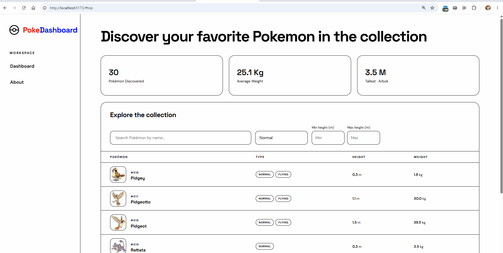

# Web Development Project 5 - PokeDashboard

Submitted by: **Jiaxing Rong**

This web app: **A Pokémon data dashboard that fetches Pokémon from PokeAPI and allows users to search, filter, and compare Pokémon information.**

Time spent: **5** hours spent in total

## Required Features

The following **required** functionality is completed:

- [x] **The site has a dashboard displaying a list of data fetched using an API call**
  - The dashboard fetches and displays 30 unique Pokémon, one per row.
  - Each row includes the Pokémon's image, name, Pokédex number, type, height, and weight.
- [x] **`useEffect` React hook and `async`/`await` are used**
  - `useEffect` loads the Pokémon data when the dashboard mounts.
  - The PokéAPI service uses `async`/`await` for the list and detail requests.
- [x] **The app dashboard includes at least three summary statistics about the data**
  - Total number of Pokémon discovered
  - Average Pokémon weight
  - Tallest Pokémon and its height
- [x] **A search bar allows the user to search for an item in the fetched data**
  - The search bar filters Pokémon by name.
  - The displayed list updates dynamically as the user types.
- [x] **An additional filter allows the user to restrict displayed items by specified categories**
  - The type dropdown filters Pokémon by type, which is a different attribute from the name search.
  - The displayed list updates dynamically when a type is selected.

The following **optional** features are implemented:

- [x] Multiple filters can be applied simultaneously
  - The name search and type filter can be used together.
- [x] Filters use different input types
  - The dashboard includes a text search input and a dropdown-style type selector.
- [x] The user can enter specific bounds for filter values
  - Minimum and maximum height inputs restrict the list to Pokémon within the entered range.

The following **additional** features are implemented:

- [x] Responsive dashboard and navigation layouts
- [x] The custom type dropdown closes after a selection or when the user clicks outside it

## Video Walkthrough

Here's a walkthrough of implemented user stories:

<!-- Replace this placeholder with your recorded GIF URL. -->

GIF created with **[ScreenToGif or another recording tool]**.

## Notes

One challenge was fetching the initial Pokémon list and then loading the detailed data required for each dashboard row. This was handled with `Promise.all` so the detail requests could be completed together.

## License

    Copyright 2026 Jiaxing Rong

    Licensed under the Apache License, Version 2.0 (the "License");
    you may not use this file except in compliance with the License.
    You may obtain a copy of the License at

        http://www.apache.org/licenses/LICENSE-2.0

    Unless required by applicable law or agreed to in writing, software
    distributed under the License is distributed on an "AS IS" BASIS,
    WITHOUT WARRANTIES OR CONDITIONS OF ANY KIND, either express or implied.
    See the License for the specific language governing permissions and
    limitations under the License.
