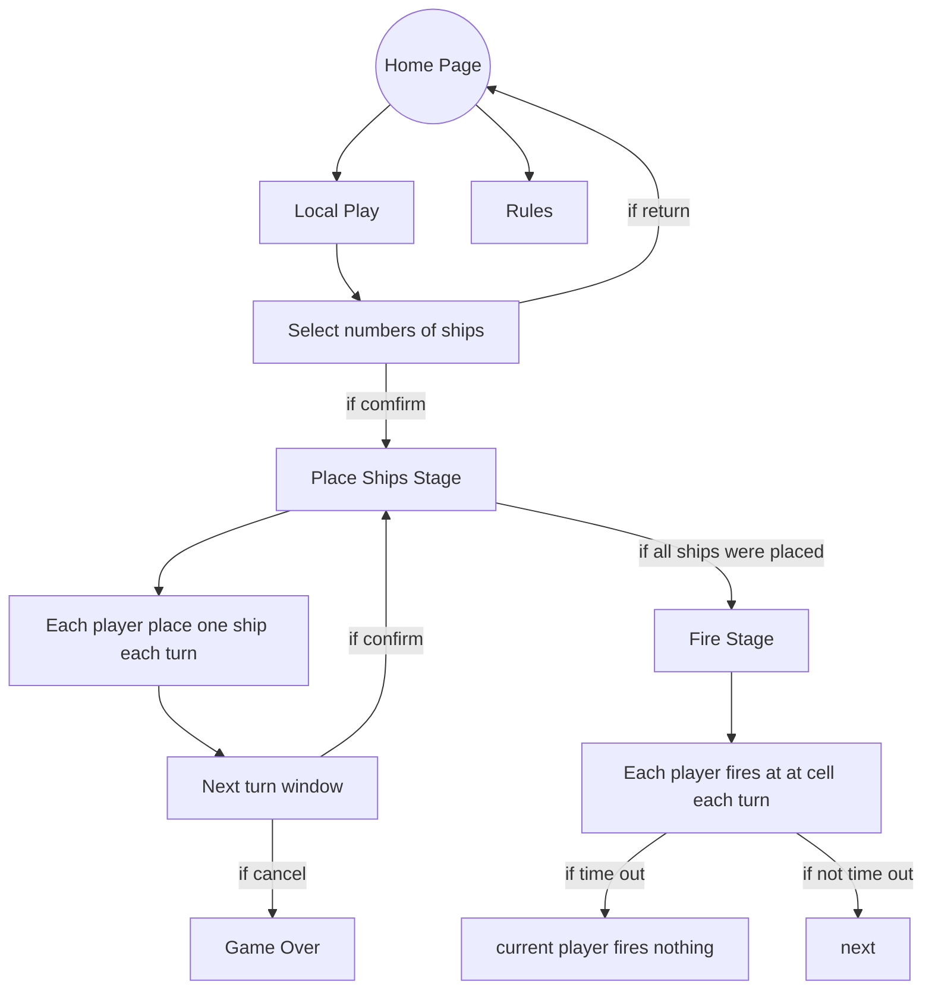

```mermaid
graph TD
start((Home Page)) --> localPlay[Local Play]
start((Home Page)) --> rules[Rules]
localPlay --> numSel[Select numbers of ships]
numSel -- if return --> start
numSel -- if comfirm --> placeShips[Place Ships Stage]
placeShips --> playerPlaceShips[Each player place one ship each turn] --> nextTurnWindow[Next turn window]
nextTurnWindow -- if confirm --> placeShips
nextTurnWindow -- if cancel --> gameOver[Game Over]
placeShips -- if all ships were placed --> fireStage[Fire Stage]
fireStage --> playerFires[Each player fires at at cell each turn]
playerFires -- if time out --> firesNothing[current player fires nothing]
playerFires -- if not time out --> next
```
